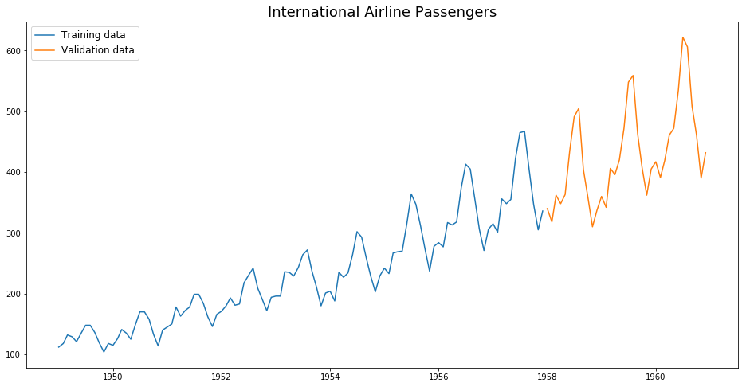
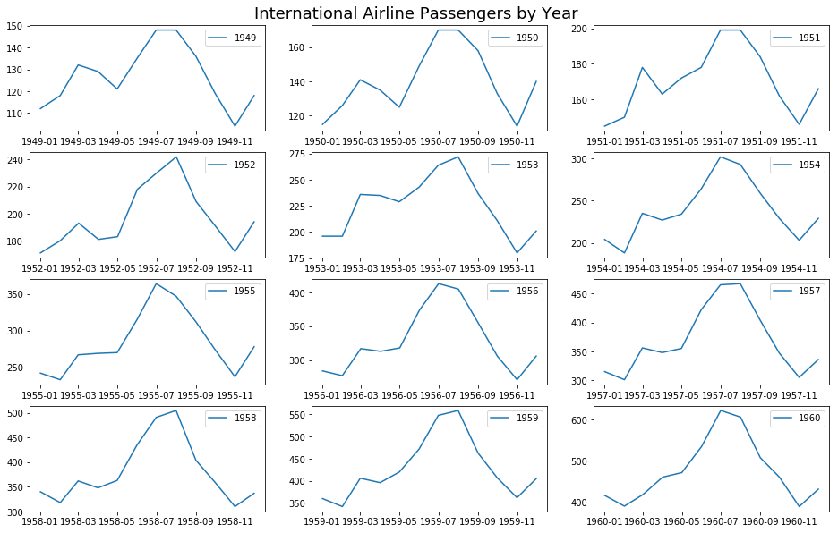
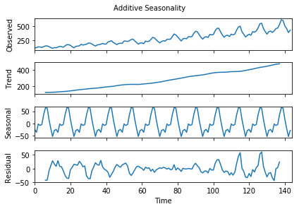
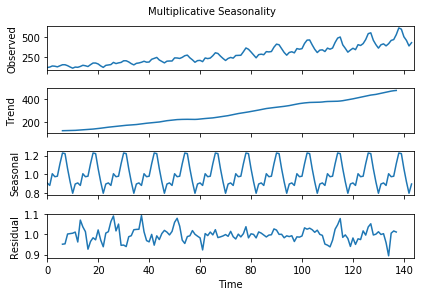
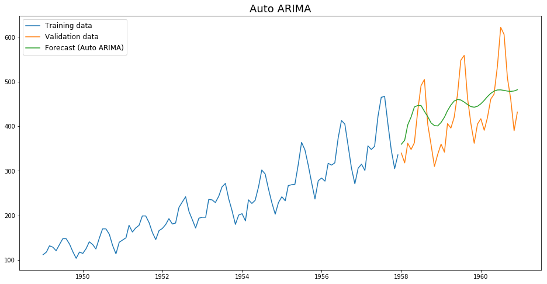
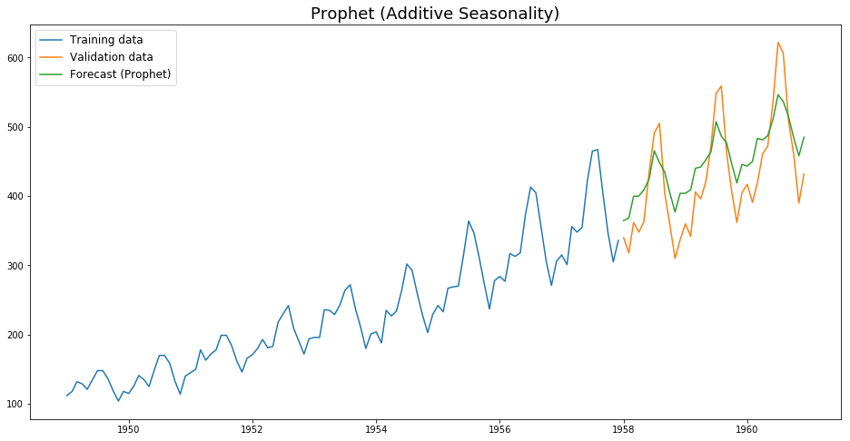
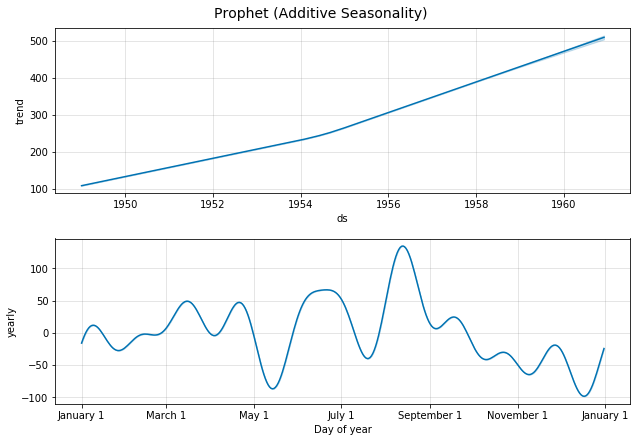
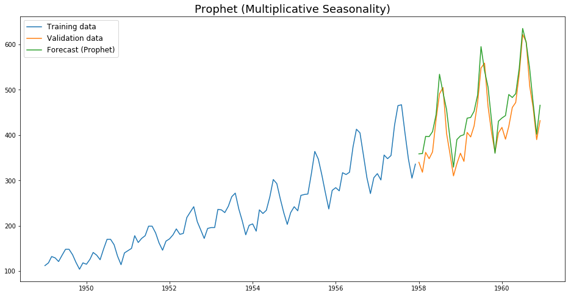
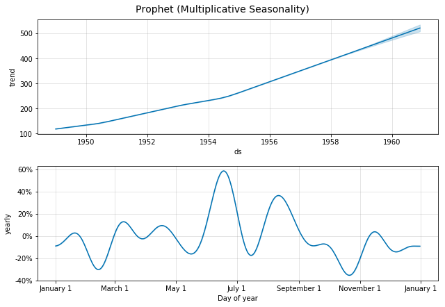

# Time Series Forecasting using Auto ARIMA and Prophet
 
This repo contains the Time Series Forecasting using Auto ARIMA and Prophet project as part of my data science portfolio. The objective is to forecast international airline passengers using a dataset from Kaggle. 

1. [Problem Statement](#problem)
2. [Dataset](#data)
3. [Exploratory Data Analysis](#eda)
4. [Auto ARIMA](#arima)
5. [Prophet](#pro)
6. [Discussion and Conclusion](#conclusion)

## <a name="problem">Problem Statement</a>
This project is implemented to explore different time series modelling techniques on a relatively simple and clean dataset. The dataset contains 12 years of international airline passengers from 1941 to 1960. The data will be split into training (1949-1957) and validation (1958-1960) sets according to the ratio of 75:25. The training set (9 years) will be used to forecast for 3 years ahead and then compare with the actual validation data. Errors will be calculated in terms of Root Mean Square Error (RMSE).

## <a name="data">Dataset</a>
The dataset used in this project is [International airline passengers](https://www.kaggle.com/andreazzini/international-airline-passengers) downloaded from [Kaggle](https://www.kaggle.com/andreazzini/international-airline-passengers). It contains monthly total number of passengers (in thousands) and has two columns – month and count of passengers.

## <a name="conclusion">Discussion and Conclusion</a> #
Comparing the time series models, Prophet performed significantly better than Auto ARIMA in forecasting the International airline passengers with the lowest RMSE. There is a clear seasonality pattern with a spike in the middle of the year (Jun-July) and Prophet has succesfully captured this pattern as seen in the component graph. However, this seasonality is not a constant additive factor, rather it grows with the trend i.e. multiplicative seasonality. Prophet can model multiplicative seasonality and thus produce impressive results in this dataset. 

If you have any feedback for this project, feel free to contact me via my [LinkedIn](https://www.linkedin.com/in/limchiahooi) or [GitHub Pages](https://limchiahooi.github.io).

---

